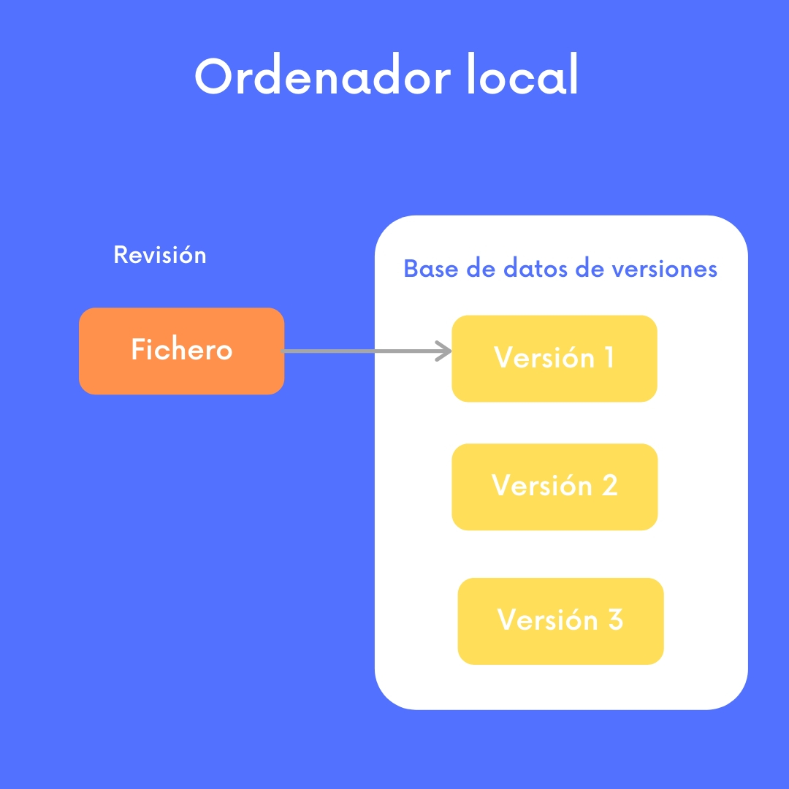

¿Alguna vez te has preguntado cuál es la diferencia entre `git revert` y  `git reset --hard`? ¿No sueles usar `git rebase` por miedo a lo que pueda pasar? Espero que esta serie de posts te ayude a repasar los fundamentos de Git y así adquirir seguidad y exprimir al máximo tu flujo de trabajo.

### Control de versiones en los proyectos de Software

Construir software es un proceso creativo que implica evolucionar con el tiempo el código fuente sobre el que se está trabajando. Es más, en la gran mayoría de casos, múltiples personas trabajan en un mismo proyecto al mismo tiempo. Es decir se van añadiendo en paralelo líneas y ficheros aquí, eliminando otras allá... Todo esto hace que se generen múltiples versiones de un proyecto en un mismo instante de tiempo, pero al final, el producto es sólo uno y queremos controlar qué aportaciones de las que ha ido haciendo cada miembro del equipo van a componer esta versión final, como si de un corta pega se tratara. Además, también queremos saber en qué estado está el código en cada momento, en definitiva, un historial de cambios. 
Esto nos ayuda a:

- Encontrar en qué momento se ha introducido un error y con qué cambio,
- Recuperar una idea previamente descartada
- Comparar versiones diferentes de los ficheros de un proyecto
- Obtener una copia de seguridad en caso de que hayamos perdido

Para poner las cosas en perspectiva, repasemos diferentes tipos de sistemas de control de versiones.

#### Sistema de Control de Versiones en local

### Entonces, ¿qué es Git?

En pocas palabras, Git es un sistema de control de versiones distribuído. Esto quiere decir que, Git guarda una copia del repositorio cada ordenador que lo haya descargado en vez de una única copia en un servidor central.

